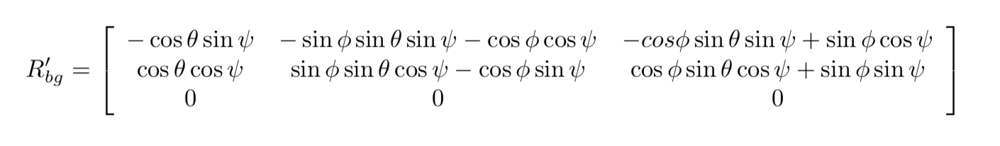
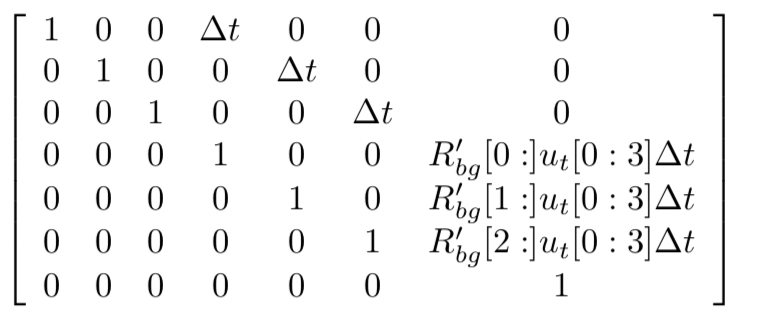
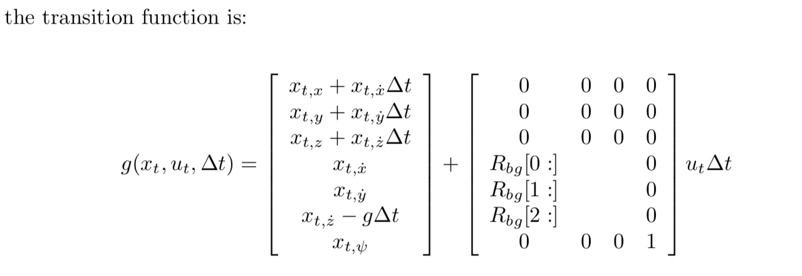
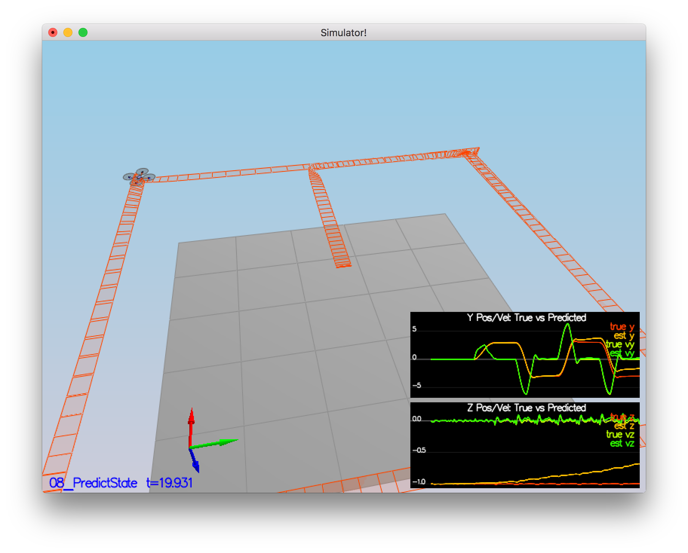
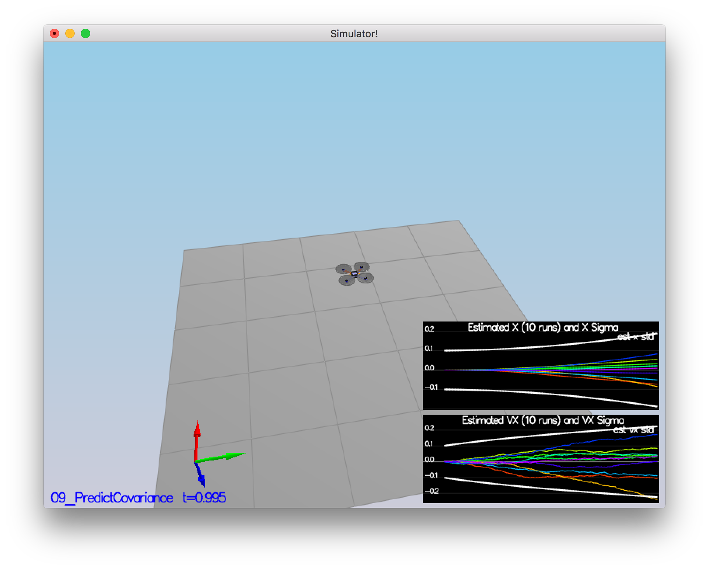

# Estimation Project #

## The Goal of this Project ##

In this project, you will be developing the estimation portion of the controller used in the CPP simulator. By the end of the project, your simulated quad will be flying with your estimator and your custom controller (from the previous project)!

## Writeup ##

### Step 1: Sensor Noise ###
#### For the controls project, the simulator was working with a perfect set of sensors, meaning none of the sensors had any noise. The first step to adding additional realism to the problem, and developing an estimator, is adding noise to the quad's sensors. The calculated standard deviation should correctly capture ~68% of the sensor measurements. ####

- The standard deviation of Quad.GPS.X and  Quad.IMU.AX from the config logs config/log/Graph1.txt and config/log/Graph1.txt is about 0.6 and 0.5.
- Set the values in config/6_Sensornoise.txt as below:
```
MeasuredStdDev_GPSPosXY = .72
MeasuredStdDev_AccelXY = .49
```
- The Result :
```
PASS: ABS(Quad.GPS.X-Quad.Pos.X) was less than MeasuredStdDev_GPSPosXY for 68% of the time
PASS: ABS(Quad.IMU.AX-0.000000) was less than MeasuredStdDev_AccelXY for 67% of the time
```
<p align="center">

</p>

### Step 2: Attitude Estimation ###
####  In this step, you will be improving the complementary filter-type attitude filter with a better rate gyro attitude integration scheme. The improved integration scheme should result in an attitude estimator of < 0.1 rad for each of the Euler angles for a duration of at least 3 seconds during the simulation.  ####

- use the Quaternion<float> class, which has a handy FromEuler123_RPY function for creating a quaternion from Euler Roll/PitchYaw.
```
    Quaternion<float> atd = Quaternion<float>::FromEuler123_RPY(rollEst, pitchEst, ekfState(6));
    atd.IntegrateBodyRate(gyro, dtIMU); //this uses quaternions

```
- Normalize yaw to -pi .. pi
- Compute predictedPitch, predictedRoll non-linear with complimentary filter for attitude using quaternions.
<p align="center">

</p>

- The Result :
```
PASS: ABS(Quad.Est.E.MaxEuler) was less than 0.100000 for at least 3.000000 seconds
```

<p align="center">

</p>

### Step 3: Prediction Step ###
####  Implementing the prediction step of the filter.  ####

- PredictState() function 
```
1. There are 7 states should be predicted : x, y, z, x_dot, y_dot, z_dot and yaw
2. The yaw integral is already done in the IMU update.

```
##### References #####
<p align="center">

</p>

-  The correct calculation of the Rgb prime matrix  
```
1. Return the partial derivative of the Rbg rotation matrix with respect to yaw.
2. Putting the right sin() and cos() functions in the right place.
3. theta = pitch; phi = roll; psi = yaw

```
##### References #####
<p align="center">

</p>

- Predict the current covariance forward by dt
```
1. Use the class MatrixXf create a matrix.
2. Calculate the necessary helper matrices, building up the transition jacobian.
3. Update cov by "ekfCov = gPrime * ekfCov * gPrime.transpose() + Q;"
```
##### References #####
<p align="center">

</p>
<p align="center">

</p>
- The Result :

<p align="center">

</p>
<p align="center">

</p>

### Step 4: Magnetometer Update ### 

#### Adding the information from the magnetometer to improve filter's performance in estimating the vehicle's heading.   ####

- 
```
1. Get the current estimated yaw.
2. Normalize the difference between your measured and estimated yaw.
3. Update Mesurement model hPrime.
```

## Flight Evaluation ##

### Meet the performance criteria of each step. ###
For each step of the project, the final estimator should be able to successfully meet the performance criteria with the controller provided. The estimator's parameters should be properly adjusted to satisfy each of the performance criteria elements. 


#### De-tune your controller to successfully fly the final desired box trajectory with your estimator and realistic sensors. ####
The controller developed in the previous project should be de-tuned to successfully meet the performance criteria of the final scenario (<1m error for entire box flight). 

```
- QuadController.cpp is updated from last project
- QuadControlParams.txt is updated from last project
- The controller added from previous project successfully meet the performance criteria of the final scenario (<1m error for entire box flight).
- Position and velocity gains have gone down from the initial value. This is enough to make the drone fly with an error of <1m for the entire box flight as shown in Task 5.
```
